No previous electronics experience is required to have fun with the Arduino Experimenter's Kit. Here are a few details about each component to make identifying, and perhaps understanding them, a bit easier.

For an introduction to what an Arduino is, visit http://arduino.cc/en/Guide/HomePage

## LED
(Light Emitting Diode)

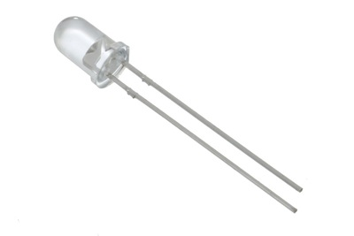

### What it Does:
Emits light when a small current is passed through it. (only in one direction) 
### No. of Leads:
2 (one longer, this one connects to positive)
### Identifying:
Looks like a mini light bulb.
### Things to watch out for:

* Will only work in one direction
* Requires a current limiting resistor

### More Details:
http://ardx.org/LED

### Exercises
[1](/exercises/1), [2](/exercises/2), [5](/exercises/5), [7](/exercises/7), [8](/exercises/8), [9](/exercises/9), [11](/exercises/11)

## Diode
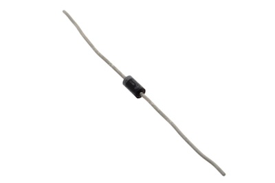
### What it Does:
The electronic equivalent of a one way valve. Allowing current to flow in one direction but not the other. 
### No. of Leads:
2 
### Identifying:
Usually a cylinder with wires extending from either end (and an off center line indicating polarity).
### Things to watch out for:
Will only work in one direction (current will flow if end with the line is connected to ground)
### More Details:
http://ardx.org/DIOD
### Exercises
[3](/exercises/3), [11](/exercises/11)

## Resistor
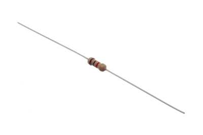

### What it Does:
Restricts the amount of current that can flow through a circuit.
### No. of Leads:
2 
### Identifying:
Cylinder with wires extending from either end. The value is displayed using a color coding system.

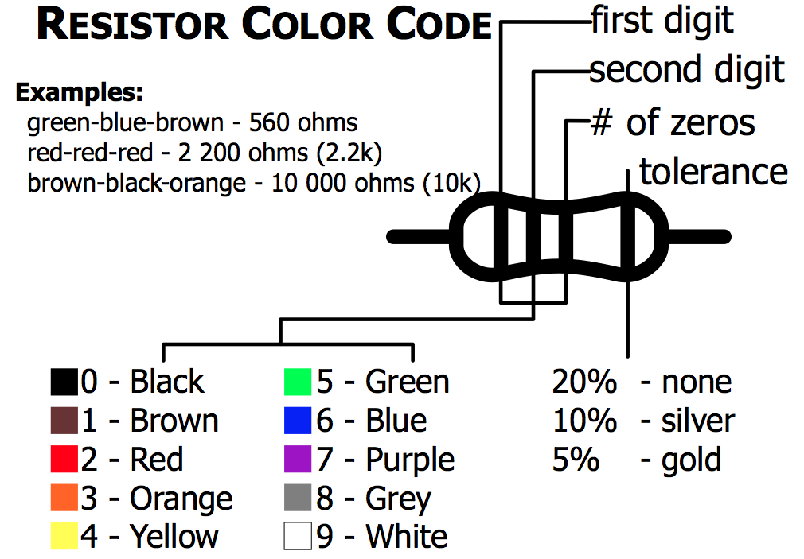

### Things to watch out for:
Easy to grab the wrong value (double check the colors before using)

### More Details:
http://ardx.org/RESI
### Exercises
[1](/exercises/1), [2](/exercises/2), [3](/exercises/3), [5](/exercises/5), [7](/exercises/7), [8](/exercises/8), [9](/exercises/9), [11](/exercises/11), [12](/exercises/12), [13](/exercises/13), [14](/exercises/14)

## Transistor
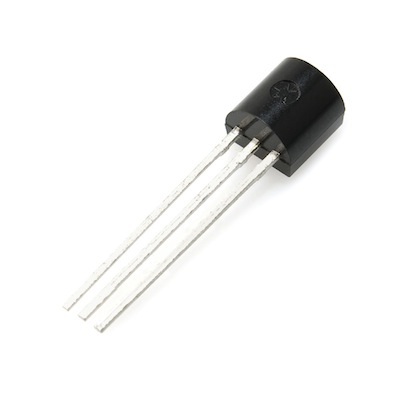
### What it Does:
Uses a small current to switch or amplify a much larger current.

### No. of Leads:
3 (Base, Collector, Emitter)
### Identifying:
Comes in many different packages but you can read the part number off the package (P2N2222AG in this kit)
### Things to watch out for:
Plugging in the right way round (also a current limiting resistor is often needed on the base pin)
### More Details:
http://ardx.org/TRAN
### Exercises
[3](/exercises/3), [11](/exercises/11)

## Servo
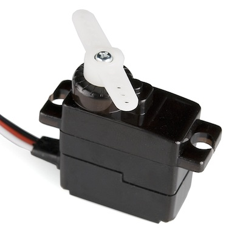
### What it Does:
Takes a timed pulse and converts it into an angular position of the output shaft.
### No. of Leads:
3
### Identifying:
A plastic box with 3 wires coming out one side and a shaft with a plastic horn out the top.
### Things to watch out for:
The plug is not polarized so make sure it is plugged in the right way.

### More Details:
http://ardx.org/SERV
### Exercises
[4](/exercises/4), [8](/exercises/8), [9](/exercises/9), [13](/exercises/13)

## DC Motor 
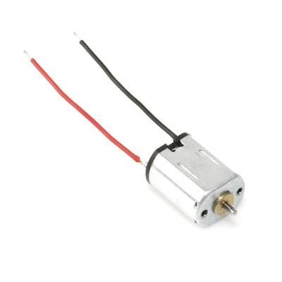
### What it Does:
Spins when a current is passed through it.
### No. of Leads:
2 
### Identifying:
Usually a cylinder with a shaft coming out of one end.
### Things to watch out for:
Using a transistor or relay that is rated for the size of motor you're using.

### More Details:
http://ardx.org/MOTO
### Exercises
[3](/exercises/3), [11](/exercises/11)

## Piezo Element
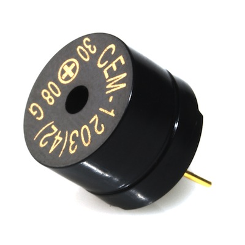
### What it Does:
A pulse of current will cause it to click. A stream of pulses will cause it to emit a tone.
### No. of Leads:
2 
### Identifying:
In this kit it comes in a little black barrel, but sometimes they are just a gold disc.
### Things to watch out for:
Difficult to misuse.

### More Details:
http://ardx.org/PIEZ

### Exercises
[6](/exercises/6)

## IC (Integrated Circuit)
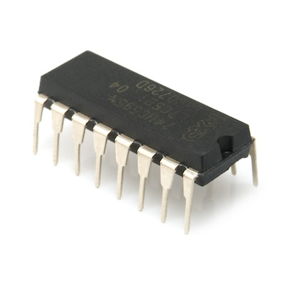
### What it Does:
Packages any range of complicated electronics inside an easy to use package.
### No. of Leads:
2 - 100s (in this kit there is one with 3 (TMP36) and one with 16 (74HC595)
### Identifying:
The part ID is written on the outside of the package (this sometimes requires a lot of light or a magnifying glass to read).
### Things to watch out for:
Proper orientation (look for marks showing pin 1)

### More Details:
http://ardx.org/ICIC

### Exercises
[5](/exercises/5)

## Pushbutton
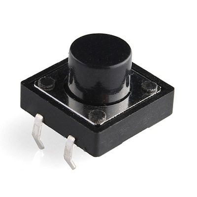
### What it Does:
Completes a circuit when it is pressed.
### No. of Leads:
4
### Identifying:
A little square with leads out the bottom and a button on the top.
### Things to watch out for:
These are almost square so can be inserted 90 degrees off angle.

### More Details:
http://ardx.org/BUTT

### Exercises
[7](/exercises/7)

## Potentiometer
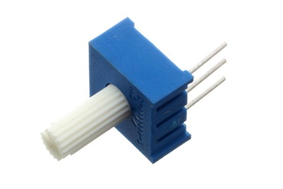

### What it Does:
Produces a variable resistance dependant on the angular position of the shaft.
### No. of Leads:
3 
### Identifying:
They can be packaged in many different form factors, look for a dial to identify.
### Things to watch out for:
Accidentally buying logarithmic scale.

### More Details:
http://ardx.org/POTE

### Exercises
[8](/exercises/8)

## Photo Resistor
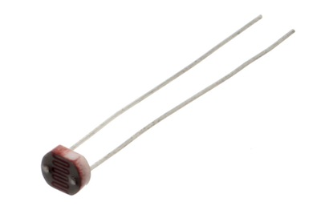
### What it Does:
Produces a variable resistance dependant on the amount of incident light.
### No. of Leads:
2 
### Identifying:
Usually a little disk with a clear top and a curvy line underneath.
### Things to watch out for:
Remember it needs to be in a voltage divider before it provides a useful input.

### More Details:
http://ardx.org/PHOT

### Exercises
[9](/exercises/9)

## TMP36 Temperature Sensor
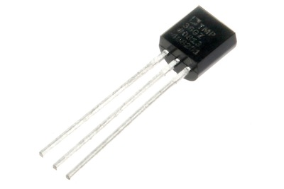
### What it Does:
Produces a variable resistance dependant on the ambient temperature. It outputs 10 millivolts per degree centigrade on the signal pin, with a 500mV offset to allow measuring negative temperatures.
### No. of Leads:
3 (ground, signal, 5V)
### Identifying:
Usually has TMP36 written on the component.
### Things to watch out for:
It looks a bit like the P2N2222AG transistors - check the text printed on the component to make sure you are using the right one.

### More Details:
http://ardx.org/TMP36

### Exercises
[10](/exercises/10)

## Relay
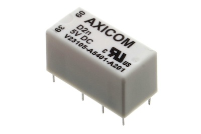
### What it Does:
Acts as an electrically controlled mechanical switch.
### No. of Leads:
Depends on the relay. We will use a SPDT relay which has 5.
### Identifying:
Looks like a box.
### Exercises
[11](/exercises/11)

## RGB LED
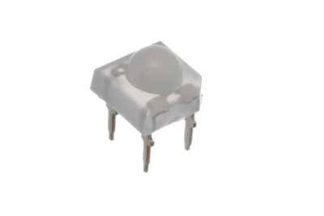
### What it Does:
Three LEDs in one package: Red, Green and Blue.
### No. of Leads:
4
### Identifying:
Looks like a regular LED, but with extra leads
### Things to watch out for:
There are two common form factors, bulb style (where the common lead is the second lead and is the longest), and Pirahna or UFO form factor (pictured - insert these into the breadboard on the diagonal).

There are two types of RGB LED, Common Anode and Common Cathode. For Common Anode, connect the common lead to 5V. For Common Cathode, connect the common lead to ground. The three other leads are for R, G and B signal. This guide assumes that you are using a Common Cathode RGB LED.
### Exercises
[12](/exercises/12)

## Solderless Breadboard
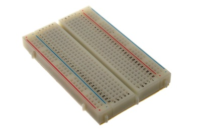
### What it Does:
Used for prototyping circuits

### Things to watch out for:
The points in each row are connected horizontally

## Header Pins
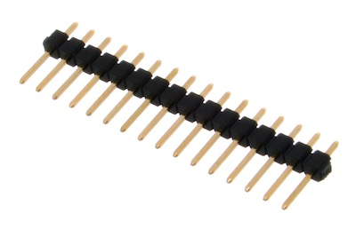
### What it Does:
In this kit, header pins are used to secure the circuit sheets to the breadboard and to connect component leads (e.g. on the servo) to the breadboard. Groups of pins can be snapped off to desired length.

