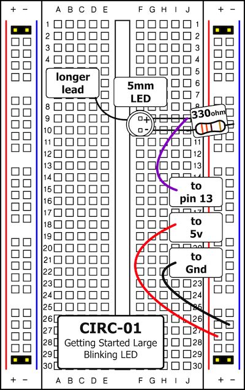
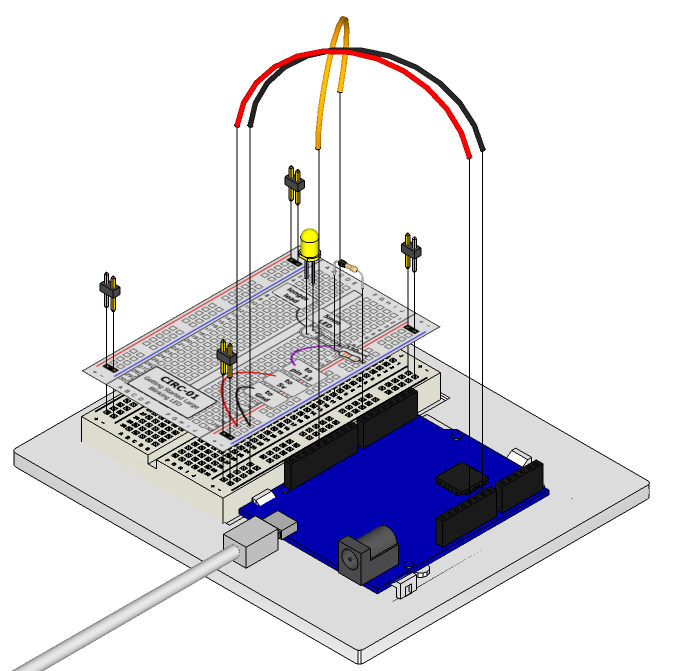

LEDs (light emitting diodes) are used in all sorts of clever things
which is why they are included in the Experimenter's kit. We will start off
with something very simple, turning one on and off, repeatedly,
producing a pleasant blinking effect. 

To get started, grab the parts listed below, pin the circuit layout sheet to your breadboard using the header pins and then plug everything in. 

**Make sure your Arduino is disconnected from the computer whenever you are connecting or disconnecting components.**

Plug the Arduino in, and run the program from the node-ardx directory as follows:

`node code/CIRC01-code-led-a-strobe.js`

You can interact with the LED via the REPL console e.g. at the `>>` prompt type `led.stop()` to make it stop blinking. Hit control-D to exit the program when you are done.

## Parts

* 2 pin header x 4
* 5mm LED 
* 330 ohm resistor (orange-orange-brown)
* jumper wires

## Circuit Layout

## Circuit Assembly

Assembly video: http://ardx.org/VIDE01

## Code

You can find this code in `code/CIRC-01-code-led-a-strobe.js`

    var five = require("johnny-five");
    var myBoard, myLed;

    myBoard = new five.Board();

    myBoard.on("ready", function() {

      myLed = new five.Led(13);

      myLed.strobe( 1000 );

      // make myLED available as "led" in REPL

      this.repl.inject({
        led: myLed
      });
      
      // try "on", "off", "toggle", "strobe", "stop" (stops strobing)
    });

## Troubleshooting

### LED Not Lighting Up?

Diodes are polarized - that means they will only work in one direction. Try taking the LED out and rotating it 180 degrees (no need to worry, installing it backwards does no permanent harm).

###  The program reports 'No USB devices detected'

Make sure you have connected the Arduino to the computer via USB.

### Still not working?
Sometimes this happens if Johnny-Five can't communicate with the Arduino via the USB serial connection. Make sure you have closed the Arduino IDE before you run the program to avoid any conflicts. If the problem persists, you can tell Johnny-Five exactly what port to use (use the port that corresponds to your Arduino) e.g:

    var board = new five.Board({port:'/dev/tty.usbmodemfa131'});

## Extending the Code

### Changing the pin:
The LED is connected to pin 13 but we can use any of the Arduino’s pins. To change it unplug the Arduino, take the wire plugged into pin 13 and move it to a pin of your choice (from 0 - 13) (you can also use analog 0 - 5). Then in the code add a variable to store the pin to make it easier to change e.g. to change it to analog 0 use:

    var ledPin = "A0";
    myLed = new five.Led(ledPin); 

### Change the blink time:
Unhappy with the default strobe speed? In the code change the parameter to the strobe method to control the speed (in milliseconds) e.g.:

    myLed.strobe(300);

### Control the brightness:
Along with digital (on/off) control the Arduino can control some pins in an analog (brightness) fashion. (more details on this in later circuits). To play around with it change the LED to pin 9 and use the `pulse` method instead of `strobe`, like we have in this program:

`node code/CIRC01-code-led-b-pulse.js`

## More

For more details on this circuit, see http://ardx.org/CIRC01
