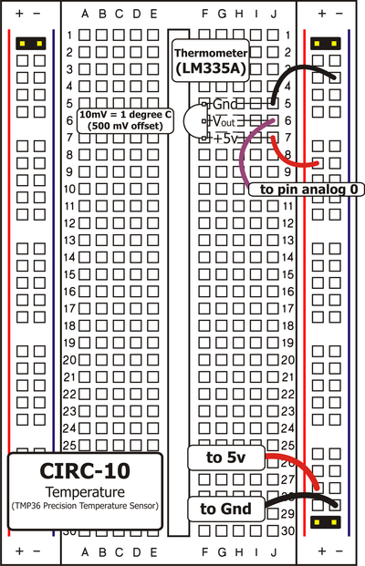
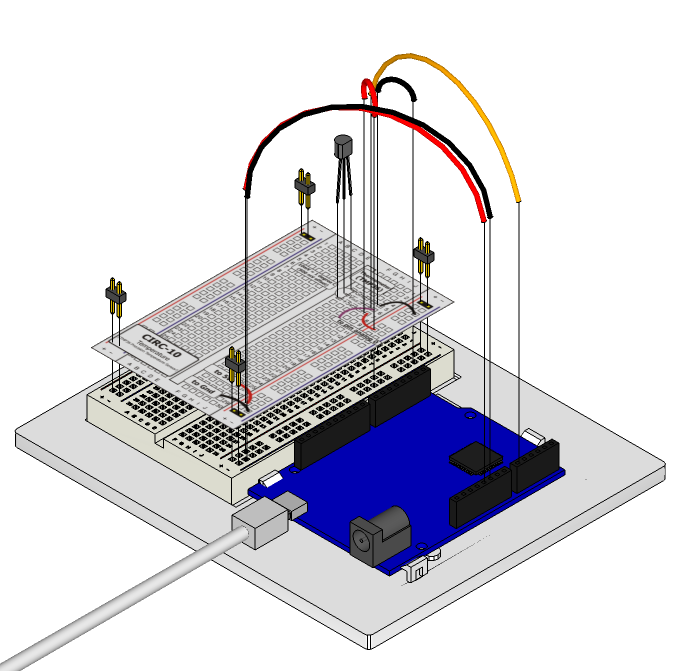

What's the next phenomena we will measure with our
Arduino? Temperature. To do this we'll use a rather
complicated IC (integrated circuit) hidden in a package
identical to our P2N2222AG transistors. It has three pins,
ground, signal and +5 volts, and is easy to use. It outputs 10
millivolts per degree centigrade on the signal pin (to allow measuring temperatures below freezing there is a 500 mV offset eg. 25° C = 750 mV, 0° C = 500mV). To convert this from the digital value to degrees, we will use some of the Arduino's math abilities.  We'll output the value to the console. Let's get to it.

The TMP36 Datasheet: http://ardx.org/TMP36

## Parts

* 2 pin header x 4
* TMP36 Temperature sensor
* jumper wires

## Circuit Layout

## Circuit Assembly

Assembly video: http://ardx.org/VIDE10

## Code

You can find this code in `code/CIRC-10-code-temperaturesensor.js`

	var five = require("johnny-five");
    var board = new five.Board();

    board.on("ready", function() {
      var temp = new five.Temperature({
        pin: "A0",
        controller: "TMP36"
      });

      temp.on("change", function() {
        console.log("Temp: %d", this.celsius);
      });
    });

## Troubleshooting

### Nothing Seems to Happen
This program has no outward indication it is working. To see the results you must look at the console output.

### Temperature Value is Unchanging
Try pinching the sensor with your fingers to heat it up or pressing a bag of ice against it to cool it down.

## Extending the Code
### Outputting voltage:
This is a simple matter of changing one line. Our sensor outputs 10mv per degree centigrade so to get voltage we display the value from the sensor. Change the line `console.log("temp is " + cel);` to print `value` instead of `cel`

### Outputting degrees Fahrenheit:
Again this is a simple change requiring only math. To
convert degrees C to degrees F we use the formula:  

`F = C * 1.8) + 32`

Add the line:

	var fahrenheit = (cel * 1.8) + 32;

## More
For more details on this circuit, see http://ardx.org/CIRC010
