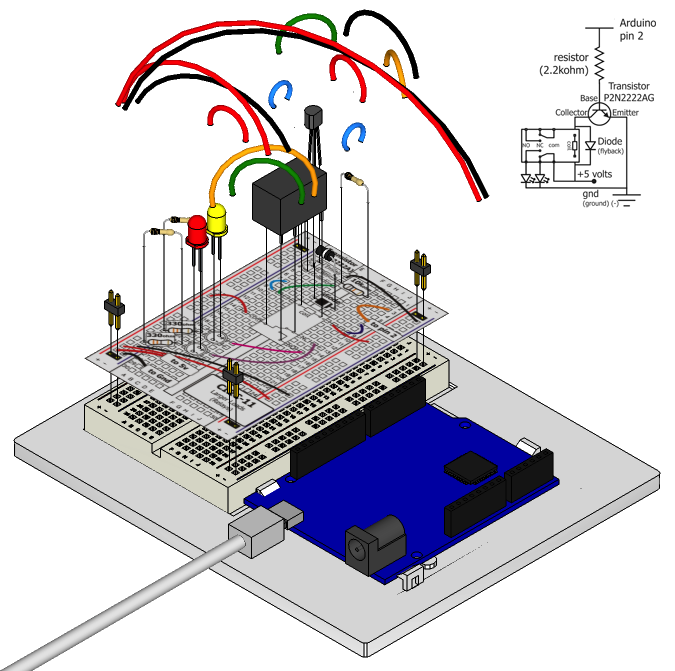

This next circuit is a bit of a test. We combine what we learned
about using transistors in [Exercise 3](/exercises/3) to control a relay. A relay is an electrically controlled mechanical switch. Inside the little plastic box is an electromagnet that, when energized, causes a switch to trip (often with a very satisfying clicking sound). You can buy relays that vary in size from a quarter of the size of the one in this kit up to as big as a fridge, each capable of switching a certain amount of current. They are immensely fun because there is an element of the physical to them. While all the silicon we've played with to this point is fun, sometimes, you may just want to wire up a hundred switches to control something magnificent. Relays give you the ability to dream it up then control it with your Arduino. Now to using today's technology to control the past. 

(The 1N4001 diode is acting as a flyback diode, for details on why it's there visit: http://ardx.org/4001)

## Parts

* 2 pin header x 4
* Diode (1N4001)
* Transistor P2N2222AG (TO92)
* Relay (SPDT)
* 5mm LED x 2 (e.g. yellow and red)
* 10k Ohm Resistor (brown-black-orange)
* 330 ohm resistor (orange-orange-brown) x 2
* jumper wires

## Circuit Layout

## Circuit Assembly

Assembly video: http://ardx.org/VIDE11

## Code

You can find this code in `code/CIRC-11-code-relay.js`

	var five = require("johnny-five");
	var myBoard = new five.Board();
	myBoard.on("ready", function() {
	  var val = 0;
	  var relay = new five.Relay(2);
	  this.loop(1000, function() {
	    if (val ^= 1) {
	      relay.on();
	    } else {
	      relay.off();
	    }
	  });
	});

## Troubleshooting

### No Clicking Sound
The transistor or coil portion of the circuit isn't quite working. Check the transistor is plugged in the right way.

### Not Quite Working
The included relays are designed to be soldered rather than used in a breadboard. As such you may need to press it in to ensure it works (and it may pop out occasionally).

## Extending the Code

### Watch the Back-EMF Pulse
Replace the diode with an LED. You’ll see it blink each time it “snubs” the coil voltage spike when it turns off.

### Controlling a Motor
In [Exercise 3](/exercises/3) we controlled a motor using a transistor. However if you want to control a larger motor a relay is a good option. To do this simply remove the red LED, and connect the motor in its place (remember to bypass the 330 Ohm resistor).

## More
For more details on this circuit, see http://ardx.org/CIRC011
