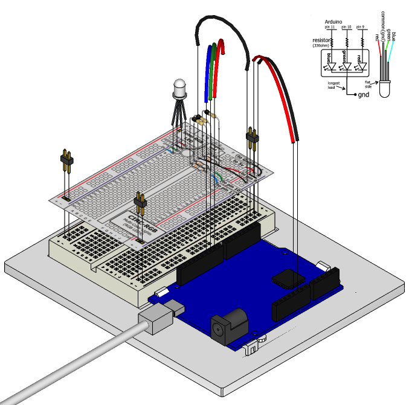

When you first started with [Exercise 1](/exercises/1) you were happy just to
get a basic LED blinking away. But you're past that now,
right? You want orange, you want teal, you want aubergine!
Fortunately there's a way to shine multiple colors from a single
LED without having to stock up on every shade of the rainbow. To do this we use an RGB LED. An RGB LED isn't a single LED - it's actually three LEDs in one small package: one Red, one Green and one Blue. When you turn them on, their light mixes together and you get other colors. The color you get is a result of the intensity of the individual red, green and blue LEDs. We control the intensity with Pulse Width Modulation (PWM), which we've used before to control LED brightness and motor speed.

## Parts

* 2 pin header x 4
* RGB LED
* 330 ohm resistor (orange-orange-brown) x 3
* jumper wires

## Circuit Layout

## Circuit Assembly

## Code

You can find this code in `code/CIRC-12-code-led-rgb.js`

	var j5 = require("johnny-five");
	j5.Board().on("ready", function() {
	  var myLed = new j5.Led.RGB([ 9, 10, 11 ]);
	  // make the LED red
	  myLed.color("#ff0000");
	  this.wait( 1000, function() {
	    // make the LED blue after 1 second
	    myLed.color("#00ff00");
	  });
	  this.wait(2000, function(){
	    // make the LED green after 2 seconds
	    myLed.color("#0000ff");
	  });
	  this.wait(3000, function(){
	    // turn the LED off after 3 seconds
	    myLed.off();
	  });
	  this.repl.inject({
	    r: myLed
	  });
	});

## Troubleshooting

### LED Remains Dark or Shows Incorrect Color
With the four pins of the LED so close together, it’s sometimes easy to misplace one. Try double checking that each pin is where it should be.

### Seeing Red
The red diode within the RGB LED may be a bit brighter than the other two. To make your colors more balanced, use a higher ohm resistor, or adjust the red value in code.

## Extending the Code

### A land of diffusion
One disadvantage of using a RGB LED made up of three separate LEDs to generate our colors is that sometimes it's possible to see the color of the individual lights. One way to workaround this is to find a way to make the light more diffuse (or scattered) so that the individual colors mix together better. Many RGB LEDs are diffused rather than clear to help improve the effectiveness of the color mixing. If the light still isn't diffuse enough you can try putting the LED behind some paper or acrylic; or inside a ping pong ball or polystyrene ball.

## More
For more information about RGB LEDs, take a look at this [Datasheet](https://www.sparkfun.com/datasheets/Components/YSL-R596CR3G4B5C-C10.pdf)