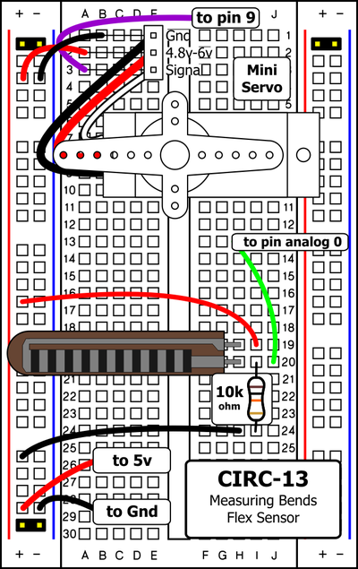
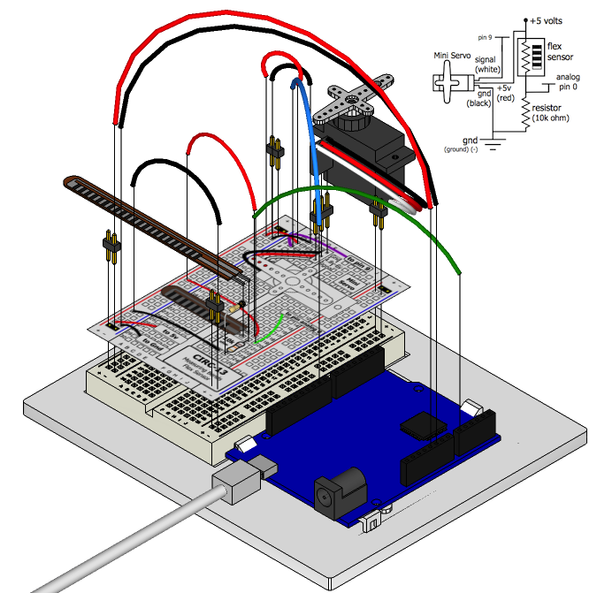

In life it's important to be flexible. But what do you do if you want to measure how flexible an object is? You use a flex sensor ([data sheet](http://www.sparkfun.com/datasheets/Sensors/Flex/flex22.pdf)). A flex sensor uses carbon on a strip of plastic to act like a variable resistor or potentiometer (see [Exercise 8](/exercises/8)) but instead of changing the resistance by turning a knob you change it by flexing (bending) the component. We use a "voltage divider" again (See [Exercise 8](/exercises/8) & [Exercise 9](/exercises/9)) to detect this change in resistance. The sensor bends in one direction and the more it bends the higher the resistance gets -- it has a range from about 10K ohm to 35K ohm. In this circuit we will use the amount of bend of the flex sensor to control the position of a servo. 

## Parts

* 2 pin header x 4
* Flex sensor
* Mini servo
* 3 pin header
* 10k Ohm Resistor (brown-black-orange)
* jumper wires

## Circuit Layout

## Circuit Assembly

## Code

You can find this code in `code/CIRC-13-code-flexsensor.js`

	var five = require("johnny-five");

	five.Board().on("ready", function(){
	  var flexSensor = new five.Sensor("A0");
	  var myServo = new five.Servo(9);

	  flexSensor.on("read", function(err, value){
	    var servoAngle = five.Fn.map(value, 50, 300, 0, 179);
	    myServo.move(servoAngle);
	  });
	});

## Troubleshooting

### Servo Not Twisting? 
Even with colored wires it is still shockingly easy to plug a servo in backwards. This might be the case.

### Servo Not Moving As Expected
The sensor is only designed to work in one direction. Try flexing it the other way. (where the striped side faces in on a convex curve)

### Servo Moves Once
You may need to modify the range of values in the call to the map function.

## Extending the Code

### Calibrating the Range
While the servo is now moving chances are its range isn't quite perfect. To adjust the range we need to change the values in the map function:

    five.Fn.map(value, fromLow, fromHigh, toLow, toHigh)

To calibrate our sensor we can use the console to print values when the sensor bends, then make a note of the range of these values. Replace the fromLow value (default 50) with the value displayed when the sensor is not bent. Then replace the fromHigh (default 300) value with the fully bent value.

 ### Applications
 With sensors the real fun comes in using them in neat and un-expected ways here are a few of our favorite flex sensor applications:

 #### One Player Rock Paper Scissors Glove
 A glove that lets you play RPS against yourself. http://ardx.org/RPS
 #### Electronic Plant Brace
 Monitor if your plant is bending towards light and fix it. http://ardg.org/BRACE 

## More
For more details about flex sensors see http://www.sparkfun.com/tutorials/270
