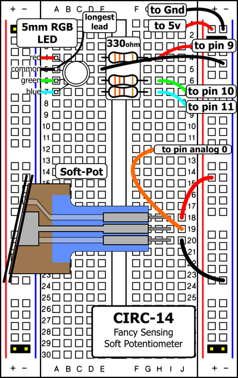
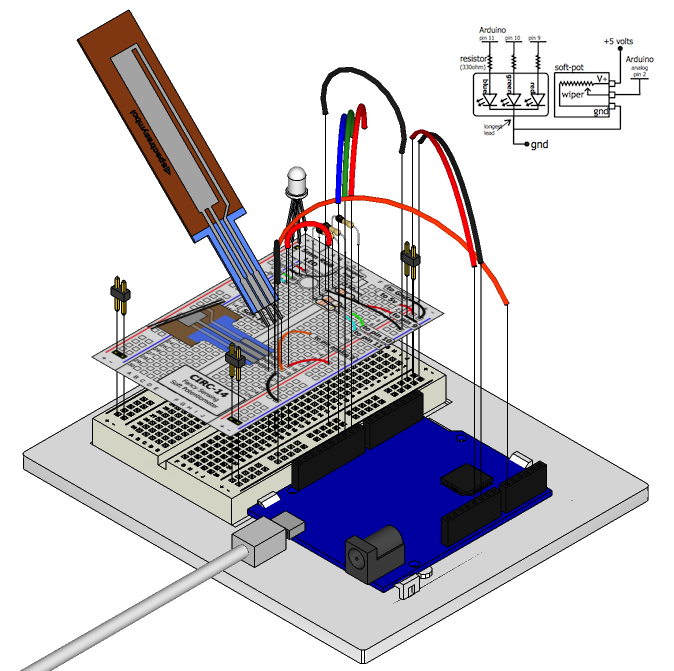

A "soft pot" (short for "soft potentiometer") is like a regular potentiometer of the style seen in [Exercise 8](/exercises/8) except it's flat, really thin and flexible and doesn't have a knob. A potentiometer is also known as a "variable resistor" and for a soft pot the resistance it provides is determined by where pressure is applied. Pressure can be applied with your finger, a stylus or a hard plastic "wiper". By pressing down on various parts of the strip, the resistance varies from 100 to 10k Ohms allowing you to calculate the relative position on the strip. You can use this to track movement on the softpot or discrete "button style" presses. In this circuit we'll use it to control the color of an RGB LED.

## Parts

* 2 pin header x 4
* RGB LED
* Soft Potentiometer
* 330 ohm resistor (orange-orange-brown)
* jumper wires

## Circuit Layout

## Circuit Assembly

## Code

You can find this code in `code/CIRC-14-code-softpot.js`

	var five = require("johnny-five"),
	    board, mySoftPot, myLed;

	function getRGB(hue) {
	  var colors = [];
	  var r = five.Fn.constrain(five.Fn.map(hue, 0, 512, 255, 0), 0, 255);
	  var g = five.Fn.constrain(
	        five.Fn.map(hue, 0, 512, 0, 255), 0, 255) -
	      five.Fn.constrain(five.Fn.map(hue, 512, 1023, 0, 255),0,255);
	  var b = five.Fn.constrain(five.Fn.map(hue, 512, 1023, 0, 255), 0, 255);
	  colors[0] = r;
	  colors[1] = g;
	  colors[2] = b;
	  return colors;
	}

	board = new five.Board();

	board.on("ready", function() {

	  myLed = new five.Led.RGB([ 9, 10, 11 ]);

	  mySoftPot = new five.Sensor({
	    pin: "A0",
	    freq: 250
	  });
	  
	  mySoftPot.on("read", function( err, value ) {
	    console.log("read value",value);
	    var rgbColors = getRGB(value);
	    myLed.color(rgbColors);
	  });
	});

## Troubleshooting
### LED Remains Dark or Shows Incorrect Color
With the four pins of the LED so close together, it's sometimes easy to misplace one. Try double checking each pin is where it should be.

#### Seeing Red
The red diode within the RGB LED may be a bit brighter than the other two. To make your colors more balanced, use a higher ohm resistor. Or adjust in code.

### Bizarre Results
The most likely cause of this is if you're pressing the potentiometer in more than one position. This is normal and can actually be used to create some neat results. 

## Extending the Code

### Faux Buttons
Because of the way the soft pot works it can also be used to make custom buttons. To do this you define a range of values corresponding to a discrete button. Use the console to determine desired values, and add a condition to test the range for each "button" that you want to create e.g:

    if (value > minValue && value < maxValue) {
    	button1Action();
    } else if (value > minValue2 && value < maxValue2) {
    	button2Action();
    }

Then cover the soft pot with a drawn/printed button pattern. 

## More
For more details on soft potentiometers see https://www.sparkfun.com/products/8680