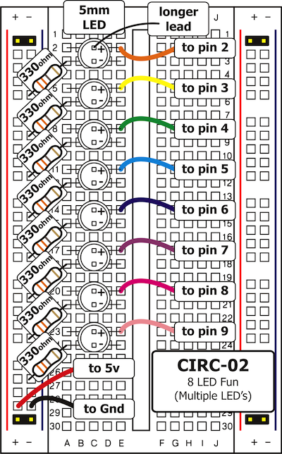
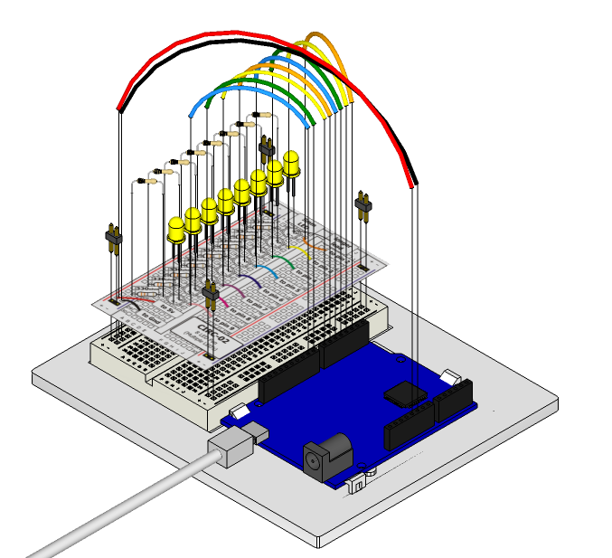

We have caused one LED to blink; now it's time to up the
stakes. Let's connect eight. We'll also have an opportunity to
stretch the Arduino a bit by creating various lighting
sequences. This circuit is also a nice setup to experiment with
writing your own programs and getting a feel for how the Arduino works.

Along with controlling the LEDs we start looking into a few  programming methods to keep your programs small:

 * for loops - used when you want to run a piece of code several times
 * arrays - used to make managing variables easier (it's a list of variables)
 * functions - callable blocks of code

## Parts

* 2 pin header x 4
* 5mm LED x 8
* 330 ohm resistor (orange-orange-brown) x 8
* jumper wires

## Circuit Layout

## Circuit Assembly

Assembly video: http://ardx.org/VIDE02

## Code

You can find this code in `code/CIRC02-code-leds.js`

	var five = require("johnny-five");
	var board = new five.Board();

	board.on("ready", function() {
	  var ledPins = [2,3,4,5,6,7,8,9];
	  var leds = new five.Leds(ledPins);

	  function oneAfterAnother() {
	    var delay = 1;
	    board.counter = 0;
	    for (var i = 0; i < leds.length; i++) {
	      var led = leds[i];

	      board.wait(delay,function(){
	        console.log(this.counter + " on")
	        leds[this.counter].on();
	      })
	      board.wait(delay + 200,function(){
	        console.log(this.counter + " off")
	        leds[this.counter].off();
	        this.counter = (this.counter + 1) % leds.length;
	      })
	      delay += 500;
	    }
	  }

	  // leds.on();
	  // board.wait(1000, leds.off.bind(leds));

	  oneAfterAnother();
	  board.loop(4500, oneAfterAnother);
	});

We use an `Leds` instance to track an collection (an array-like) of LED objects. We can use for loops to iterate over (i.e. do something for each item in) the collection.

We have structured the program by breaking it down into functions (`allOn`, `allOff` and `oneAfterAnother`)

We use the `board.wait` method to schedule behaviour at certain times. It takes two parameters - the number of milliseconds to wait, and a function that provides the code to run after waiting for the specified delay.

## Troubleshooting

### Some LEDs Fail to Light
It is easy to insert an LED backwards. Check the LEDs that aren't working and ensure they are the right way around.

###  Operating out of sequence
With eight wires, it's easy to cross a couple. Double check that the first LED is plugged into pin 2 and each pin there after.

### Starting afresh
It's easy to accidentally misplace a wire without noticing. Pulling everything out and starting with a fresh slate is often easier than trying to track down the problem.

## Extending the Code

### Disabling code using comments
At the end of the program you will see two lines commented out (the `//` at the front of the lines disables those lines). These represent an alternative behaviour (all LEDs turn on once and then off). Uncomment these lines and comment out the final two lines of the program using `//` to switch the behaviour of the program.

### Extra animations
Bored of the default animation? Try modifying the timing of the `oneAfterAnother` function, or write your own animation function: the `board.loop` and `board.wait` functions will come in handy for scheduling LEDs to go on or off (or pulse, or change brightness etc) at scheduled times.

### Confused?
Don't worry! This exercise is about exploring what is possible so there is a lot going on here. We'll take a step back to simpler code for the next couple of exercises.

## More

For more details on this circuit, see http://ardx.org/CIRC02
