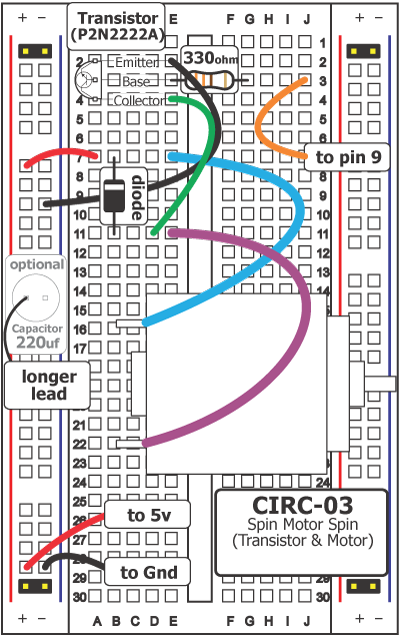
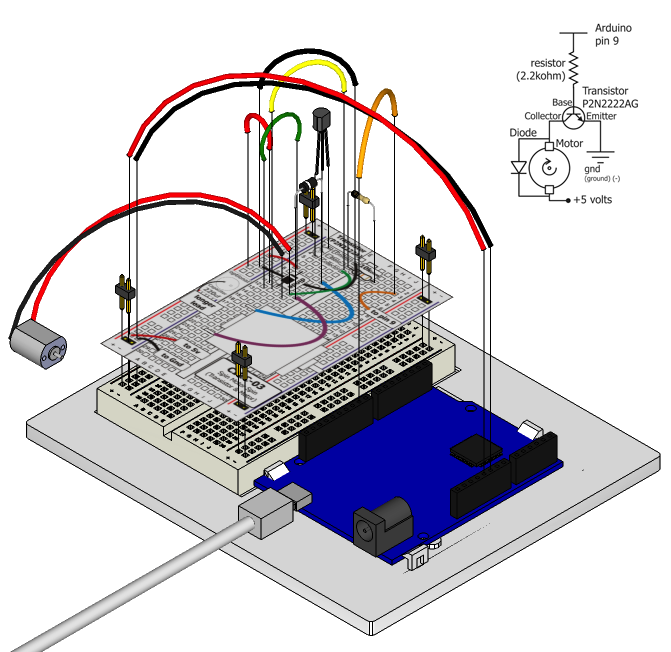

The Arduino's pins are great for directly controlling small electric
items like LEDs. However, when dealing with larger items (like a
toy motor or washing machine), an external transistor is required. A
transistor is incredibly useful. It switches a lot of current using a
much smaller current. A transistor has 3 pins. For a negative type (NPN)
transistor, you connect your load to collector and the emitter to ground. Then when a small current flows from base to the emitter, a current will flow through the transistor and your motor will spin. There are literally thousands of different types of transistors, allowing every situation to be perfectly matched. We have chosen a P2N2222AG, a rather common general purpose transistor. The important factors in our case are that its maximum voltage (40v) and its maximum current (200 milliamp) are both high enough for our toy motor (full details can be found on its datasheet http://ardx.org/2222).

The 1N4001 diode is acting as a flyback diode. For details on why it's there visit: http://ardx.org/4001

## Parts

* 2 pin header x 4
* Transistor P2N2222AG (TO92)
* Toy motor
* Diode (1N4001) 
* 330 Ohm Resistor (orange-orange-brown)
* jumper wires

## Circuit Layout

## Circuit Assembly

Assembly video: http://ardx.org/VIDE03

## Code

You can find this code in `code/CIRC03-code-motor.js`

	var five = require("johnny-five"),
	    board, myMotor, led;
	board = new five.Board();
	board.on("ready", function() {
	  myMotor = new five.Motor({
	    pin: 9
	  });
	  // event handlers on start and stop
	  myMotor.on("start", function( err, timestamp ) {
	    console.log( "started", timestamp );

	    // stop after 2 seconds
	    board.wait(2000, function() {
	      myMotor.stop();
	    });
	  }); 
	  myMotor.on("stop", function( err, timestamp ) {
	    console.log( "stopped", timestamp );
	  });
	  myMotor.start();
	});

## Troubleshooting

### Motor Not Spinning?
If you sourced your own transistor, double check with the data sheet that the pinout is compatible with a P2N2222AG (many are reversed).

### Still no luck?
If you sourced your own motor, double check that it will work with 5 volts and that it does not draw too much power. You may need to connect an external power source.

### Still not working?
Sometimes the Arduino board will disconnect from the computer. Try un-plugging and then re-plugging it into your USB port.

## Extending the Code

### Controlling speed:
We played with the Arduino's ability to control the brightness of an LED earlier, now we will use the same feature to control the speed of our motor. The Arduino does this using something called Pulse Width Modulation (PWM). This relies on the Arduino's ability to operate really, really fast. Rather than directly controlling the voltage coming from the pin the Arduino will switch the pin on and off very quickly. In the computer world this is going from 0 to 5 volts many times a second, but in the human world we see it as a voltage. For example if the Arduino is PWM'ing at 50% we see the light dimmed 50% because our eyes are not quick enough to see it flashing on and off. The same feature works with transistors. Don't believe it? Try it out - provide a parameter to the start method to control the speed (between 0 and 255):

    myMotor.start(250);

## More

For more details on this circuit, see http://ardx.org/CIRC03
