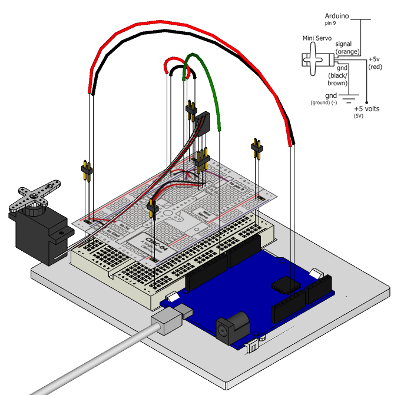

Spinning a motor is good fun but when it comes to projects
where motion control is required they tend to leave us
wanting more. The answer? Hobby servos. They are mass
produced, widely available and cost anything from a couple of
dollars to hundreds. Inside is a small gearbox (to make the movement more powerful) and some electronics (to make it easier to control). A standard servo is positionable from 0 to 180 degrees. Positioning is controlled through a timed pulse, between 1.25 milliseconds (0 degrees) and 1.75 milliseconds (180 degrees) (1.5 milliseconds for 90 degrees). Timing varies between manufacturer. If the pulse is sent every 25-50 milliseconds the servo will run smoothly. 

## Parts

* 2 pin header x 4
* 3 pin header
* mini servo
* jumper wires

## Circuit Layout

## Circuit Assembly

Assembly video: http://ardx.org/VIDE04

It's interesting to note that we don't actually need to use the breadboard in this circuit. We can just plug jumper wires directly into the servo's connector (one per hole) and into the Arduino. The black lead should go to one of the Arduino's Gnd pins, the red lead should go to a +5v pin, and the white lead should go to Pin 9.

## Code

You can find this code in `code/CIRC04-code-servo.js`

	var five = require("johnny-five"),
    board, myServo;
	board = new five.Board();
	board.on("ready", function() {
	  myServo = new five.Servo(9);

	  board.repl.inject({
	    servo: myServo
	  });

	  myServo.sweep();

	  this.wait(5000, function(){
	    myServo.stop();
	    myServo.center();
	  });  
	});

## Troubleshooting

### Servo Not Twisting?
Even with colored wires it is still shockingly easy to plug a servo in backwards. This might be the case.

### Still Not Working
A mistake we made a time or two was simply forgetting to connect the power (red and brown wires) to +5 volts and ground.

### Fits and Starts
If the servo begins moving then twitches, and there's a flashing light on your Arduino board, the power supply you are using is not quite up to the challenge. Connecting an external power source (e.g. a fresh battery) instead of USB should solve this problem.

## Extending the Code

### Potentiometer control

We have yet to experiment with inputs but if you would like to read ahead, [Exercise 8](/exercises/8) uses a potentiometer to control an LED. See the [Extending the Code](/exercises/8#extending) section for an exercise to write code to use a potentiometer to control the speed of a servo.

### Great ideas
Servos can be used to do all sorts of great things. Here are a few of our favorites:

* Christmas Hit counter: http://ardx.org/XMAS
* Open Source Robotic Arm (uses a servo controller as well as the Arduino): http://ardx.org/RARM
* Servo Walker: http://ardx.org/SEWA

## More

For more details on this circuit, see http://ardx.org/CIRC04
