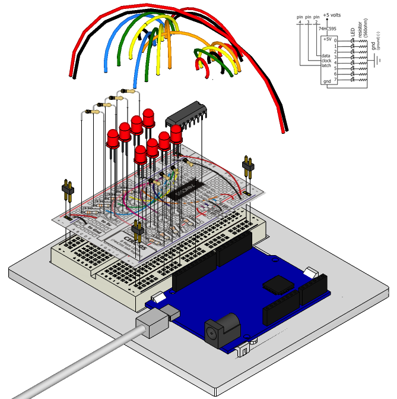

Time to start playing with chips, or integrated circuits (ICs) as they like to be called. The external packaging of a chip can be very deceptive. For example, the chip on the Arduino board (a microcontroller) and the one we will use in this circuit (a shift register) look very similar but are in fact rather different. The price of the ATMega chip on the Arduino board is a few dollars while the 74HC595 is a couple dozen cents. It's a good introductory chip, and once you're comfortable playing around with it and its datasheet (available online http://ardx.org/74HC595 ) the world of chips will be your oyster. The shift register (also called a serial to parallel converter), will give you an additional 8 outputs (to control LEDs and the like) using only three Arduino pins. They can also be linked together to give you a nearly unlimited number of outputs using the same four pins. For a more in depth look at how a shift register works visit: http://ardx.org/SHIF

## Parts

* 2 pin header x 4
* 5mm LED x 8
* 330 ohm resistor (orange-orange-brown) x 8
* Shift Register 74HC595
* jumper wires

## Circuit Layout

## Circuit Assembly

Assembly video: http://ardx.org/VIDE05

## Code

You can find this code in `code/CIRC-05-code-shiftregister.js`

	var five = require("johnny-five"),
	    board, shiftRegister;
	board = new five.Board();
	board.on("ready", function() {
	  shiftRegister = new five.ShiftRegister({
	    pins: {
	      data: 2,
	      clock: 3,
	      latch: 4
	    }
	  });
	  var value = 0;
	  function next() {
	    value = value > 0x11 ? value >> 1 : 0x88;
	    shiftRegister.send( value );
	    setTimeout(next, 300);
	  }
	  this.repl.inject({
	    sr: shiftRegister
	  });
	  next();
	});

## Troubleshooting

### The Arduino's power LED goes out 
This can happen when the chip is inserted backwards. If you fix it quickly nothing will break. 

### Not Quite Working
It is probably something as simple as a crossed wire or reversed LED.

## Extending the Code

### Understanding what's happening

The Johnny-Five ShiftRegister object hides the low level details of sending a value to the shift register. To send data to a shift register, you “clock in” the data and then lock it in (latch it). To do this the code sets the data pin to either HIGH or LOW, pulses the clock, then sets the data pin again and pulses the clock repeating until it has shifted out 8 bits of data. Then it pulses the latch and the 8 bits are transferred to the shift register's pins. It sounds complicated but is really simple once you get the hang of it.

If you look at the code for the ShiftRegister `send` method, you can see how this is implemented in Johnny-Five: 

	ShiftRegister.prototype.send = function( value ) {
	  this.board.digitalWrite( this.pins.latch, this.firmata.LOW );
	  this.board.shiftOut( this.pins.data, this.pins.clock, true, value );
	  this.board.digitalWrite( this.pins.latch, this.firmata.HIGH );

	  return this;
	};

### Controlling individual LEDs

Time to start controlling the LEDs in a similar method as we did in [Exercise 2](/exercises/2). As the eight LED states are stored in one byte (an 8 bit value) e.g. the binary (base-2) number `10000100` represents that the first and sixth LED will be on, while the others will be off. To control which LEDs are on, use the `send` method, providing the decimal (base-10) or hexidecimal (base-16) equivalent of the binary number for the pattern you want (e.g. 0x84 for the above pattern).

Comment out the next() function call at the end and run the program again. Use the REPL to try sending diferent values to the shift register until you understand how this works e.g. the following will turn all LEDs off and then turn on LED 2: 

    sr.send(0);
    sr.send(0x02);

Some patterns to try:

Pattern      | Binary Value | Hex value | Decimal Value
-------------|--------------|-----------|--------------
LED 8 only   | 00000001     | 0x01      | 1
LED 7 only   | 00000010     | 0x02      | 2
LED 6 only   | 00000100     | 0x04      | 4
LED 5 only   | 00001000     | 0x08      | 8
LED 4 only   | 00010000     | 0x10      | 16
LED 3 only   | 00100000     | 0x20      | 32
LED 2 only   | 01000000     | 0x40      | 64
LED 1 only   | 10000000     | 0x80      | 128

 For details on how this works take a look at http://ardx.org/BINA. An Arduino is very good at manipulating bits and there are an entire set of operators that help us out. Details on bitwise maths ( http://ardx.org/BITW ).

## More

For more details on this circuit, see http://ardx.org/CIRC05