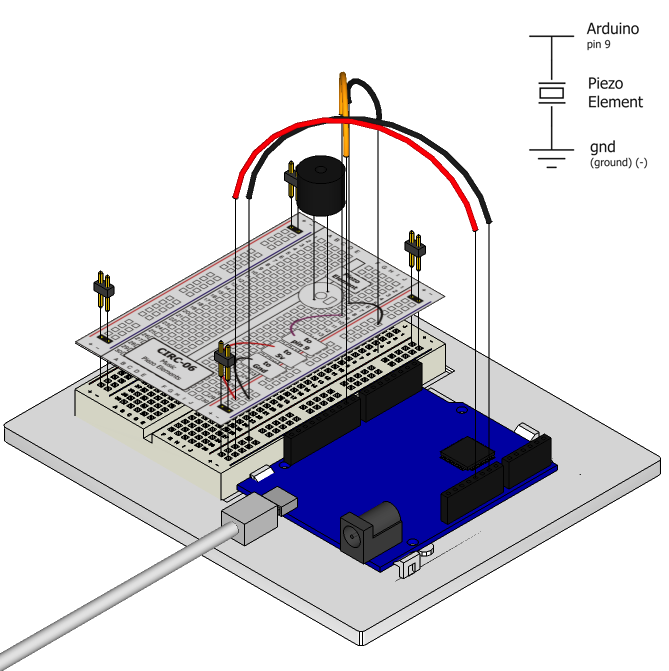

To this point we have controlled light, motion, and
electrons. Let's tackle sound next. But sound is an
analog phenomena, how will our digital Arduino cope?
We will once again rely on its incredible speed which will let it
mimic analog behavior. To do this, we will attach a piezo element to one of the Arduino's digital pins. A piezo element makes a clicking sound each time it is pulsed with current. If we pulse it at the right frequency (for example 440 times a second to make the note middle A) these clicks will run together to produce notes.

## Parts

* 2 pin header x 4
* Piezo element
* jumper wires

## Circuit Layout

## Circuit Assembly

Assembly video: http://ardx.org/VIDE06

## Code

You can find this code in `code/CIRC-06-code-beep.js`

	var five = require("johnny-five");

	five.Board().on("ready", function() {
	  var piezo = new five.Piezo(9);
	  var val = 0;

	  this.loop(200, function() {
	    if (val ^= 1) {
	      // Play note a4 for 1/5 second
	      piezo.frequency(five.Piezo.Notes["a4"], 200);
	    }
	  });
	});

## Troubleshooting

### No Sound
Given the size and shape of the piezo element it is easy to miss the right holes on the breadboard. Try double checking its placement.

### Can't Think While the Notes are Playing?
Just pull up the piezo element whilst you think, run the program then plug it back in.

## Extending the Code

Take a look at piezo.js in johnny-five's lib folder for an example of how to write functions to work with tones and durations rather than directly talking to the hardware.

## More

For more details on this circuit, see http://ardx.org/CIRC06
