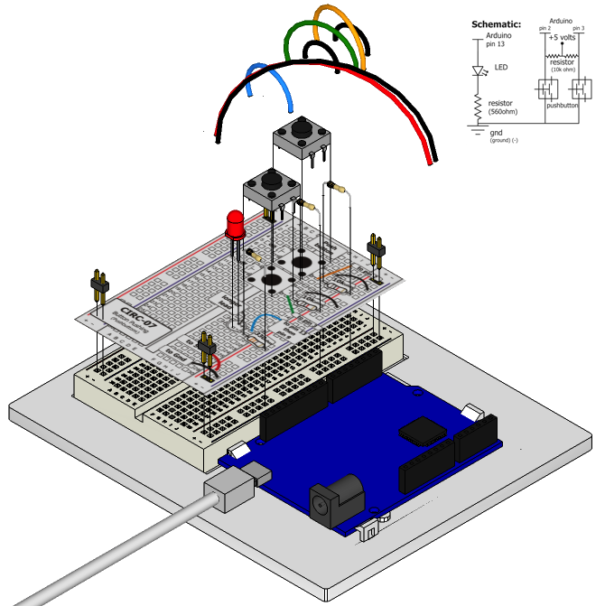

Up to this point we have focused entirely on outputs, time to
get our Arduino to listen, watch and feel. We'll start with a
simple pushbutton. Wiring up the pushbutton is simple. There is
one component, the pull up resistor, that might seem out of place.
This is included because an Arduino doesn't sense the same way we do (ie button pressed, button unpressed). Instead it looks at the voltage on the pin and decides whether it is HIGH or LOW. The button is set up to pull the Arduino's pin LOW when it is pressed, however, when the button is unpressed the voltage of the pin will float (causing occasional errors). To get the Arduino to reliably read the pin as HIGH when the button is unpressed, we add the pull up resistor.

(note: the first example program uses only one of the two buttons)

## Parts

* 2 pin header x 4
* 5mm LED 
* Pushbutton x 2
* 330 ohm resistor (orange-orange-brown)
* 10k Ohm Resistor (brown-black-orange) x 2
* jumper wires

## Circuit Layout

## Circuit Assembly

Assembly video: http://ardx.org/VIDE07

## Code

	var five = require("johnny-five"),
	    onButton, offButton, led;
	five.Board().on("ready", function() {
	  onButton = new five.Button(2);
	  led = new five.Led(13);

	  onButton.on("down", function(value){
	    led.on();
	  });

	});

## Troubleshooting

### Light Not Turning On
The pushbutton is square and because of this it is easy to put it in the wrong way. Rotate it 90 degrees and see if it starts working.

### Light Not Fading
A bit of a silly mistake we constantly made, when you switch from simple on off to fading remember to move the LED wire from pin 13 to pin 9.

### Underwhelmed?
No worries these circuits are all super stripped down to make playing with the components easy, but once you throw them together the sky is the limit.

## Extending the Code

### On button off button:
The initial example may be a little underwhelming (we don't really need an Arduino to do this), so let’s make it a little more complicated. One button will turn the LED on the other will turn the LED off. Add the following to the code:

	offButton = new five.Button(3);
	offButton.on("down", function(){
	    led.off();
	});

You can find this code in `code/CIRC-07-code-button.js`

### Fading up and down
Let's use the buttons to control an analog signal. To do this
you will need to change the wire connecting the LED from pin
13 to pin 9, also change the code to use the fadeIn and fadeOut methods. These methods take a parameter that controls the speed of the fade.

## More

For more details on this circuit, see http://ardx.org/CIRC07
