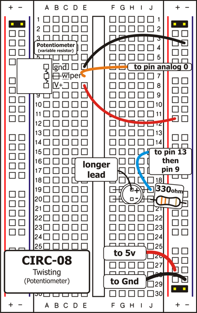
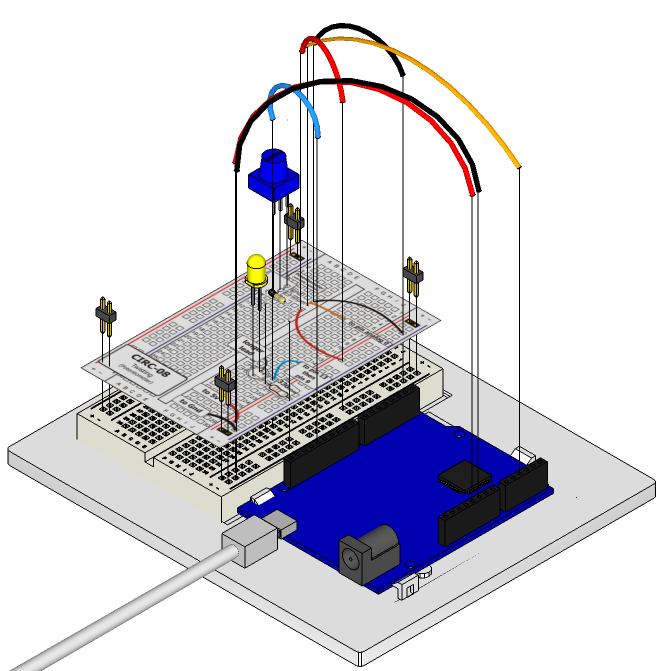

Along with the digital pins, the Arduino also has 6
pins which can be used for analog input. These
inputs take a voltage (from 0 to 5 volts) and convert
it to a digital number between 0 (0 volts) and 1024 (5 volts) (10 bits of resolution). A very useful device that exploits these inputs is a potentiometer (also called a variable resistor). When it is connected with 5 volts across its outer pins the middle pin will read some value between 0 and 5 volts dependent on the angle to which it is turned (ie. 2.5 volts in the middle). We can then use the returned values as a variable in our program.

## Parts

* 2 pin header x 4
* Potentiometer 10k ohm
* 5mm LED
* 330 ohm resistor (orange-orange-brown)
* jumper wires

## Circuit Layout

## Circuit Assembly

Assembly video: http://ardx.org/VIDE08

## Code

You can find this code in `code/CIRC-08-code-pot.js`

	var five = require("johnny-five"),
	    board, myPotentiometer;
	board = new five.Board();
	board.on("ready", function() {
	  myPotentiometer = new five.Sensor({
	    pin: "A0",
	    freq: 250
	  });
	  myLed = new five.Led(9);
	  myPotentiometer.on("read", function() {
	    var rawValue = this.raw;
	    myLed.brightness(Math.floor(rawValue / 4));
	  });
	});

## Troubleshooting

### Sporadically Working
This is most likely due to a slightly dodgy connection with the potentiometer's pins. This can usually be conquered by taping the potentiometer down.

### Not Working
Make sure you haven't accidentally connected the potentiometer's wiper to digital pin 2 rather than analog pin 2 (the row of pins beneath the power pins)

### Still Backward
You can try operating the circuit upside down. Sometimes this helps.

## Extending the Code

### Threshold switching

Sometimes you will want to switch an output when a value exceeds a certain threshold. To do this with a potentiometer, add a variable for the threshold value to your program (e.g. `var threshold = 512;`) and change the code in the "data" handler to:
    
	if (this.raw > threshold) {
	   myLed.on();
	} else {
	   myLed.off();   
	}

Alternatively, Johnny-Five `Sensor` objects can have a boolean threshold assigned to them, like this: 

	
	myPotentiometer.booleanAt(512).on("data", function() {
	  if (this.boolean) {
	    myLed.on();
	  } else {
	    myLed.off();   
	  }
	});

### Controlling a servo:
This is a really neat example and brings a couple of circuits together. Wire up the servo like you did in [Exercise 4](/exercises/4), then modify the "read" handler to set the position of the servo using `servo.move(someValue)`. You can use the map function to map a number from one range to another.e.g. `five.Fn.map(rawValue, 0, 1023, 0, 179)` to map the value from the potentiometer to an angle between 0 and 180 for the servo.

Run your program and then watch as the servo shaft turns as you turn the potentiometer.

## More

For more details on this circuit, see http://ardx.org/CIRC08
