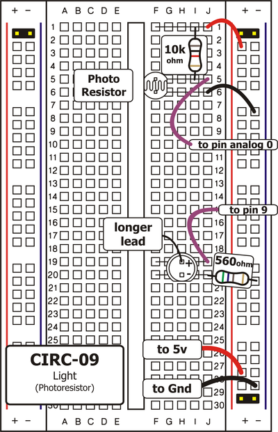
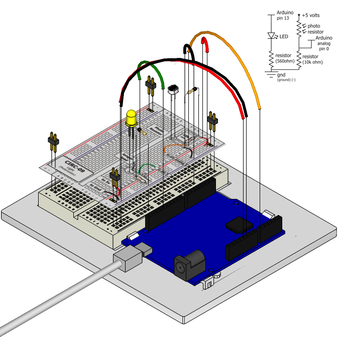

Whilst getting input from a potentiometer can be useful
for human controlled experiments, what do we use
when we want an environmentally controlled
experiment? We use exactly the same principles but instead
of a potentiometer (twist based resistance) we use a photo resistor (light based resistance). The Arduino cannot directly sense resistance (it senses voltage) so we set up a voltage divider (http://ardx.org/VODI). The exact voltage at the sensing pin is calculable, but for our purposes (just sensing relative light) we can experiment with the values and see what works for us. A low value will occur when the sensor is well lit while a high value will occur when it is in darkness.

## Parts

* 2 pin header x 4
* 5mm LED 
* 330 ohm resistor (orange-orange-brown)
* 10k Ohm Resistor (brown-black-orange)
* Photo resistor
* jumper wires

## Circuit Layout

## Circuit Assembly

Assembly video: http://ardx.org/VIDE09

## Code

You can find this code in `code/CIRC-09-code-photoresistor.js`

	var five = require("johnny-five"),
	    board, myPhotoresistor, myLed;
	board = new five.Board();
	board.on("ready", function() {
	  myLed = new five.Led(9);
	  myPhotoresistor = new five.Sensor({
	    pin: "A0",
	    freq: 250
	  });
	  myPhotoresistor.on("read", function( err, value ) {
	    // range of led brightness is 0 - 255
	    var brightnessValue = five.Fn.constrain(five.Fn.map(value, 0, 900, 0, 255), 0, 255);
	    myLed.brightness(brightnessValue);
	  });
	});

## Troubleshooting

### LED Remains Dark
This is a mistake we continue to make time and time again, if only they could make an LED that worked both ways. Pull it up and rotate it.

### It Isn't Responding to Changes in Light. 
Given that the spacing of the wires on the photo-resistor is 
not standard, it is easy to  misplace it. Double check it's in 
the right place.

### Still not quite working?
You may be in a room which is either too bright or dark. Try turning the lights on or off to see if this helps. Or if you have a flashlight near by give that a try.

## Extending the Code

### Reverse the response:
Perhaps you would like the opposite response. Don't worry we can easily reverse this response just add:

    brightnessValue = 255 - brightnessValue;

Run the program again and watch the response change

### Night light:
Rather than controlling the brightness of the LED in
response to light, let's instead turn it on or off based on
a threshold value. Change the photoresistor's data handler to:

	myPhotoresistor.on("data", function( err, value ) {
	  var threshold = 300;
	  if (value > threshold) {
	    myLed.on();
	  } else {
	    myLed.off();
	  }
	});

Or: 

	myPhotoresistor.booleanAt(512).on("data", function( err, value ) {
	    if (this.boolean) {
	    	myLed.on();
	    } else {
	    	myLed.off();
	    }
	});

### Light controlled servo
Let's use our newly found light sensing skills to control a servo. Wire up a servo connected to pin 9 (like in [Exercise 4](/exercises/4)). Then open the code you wrote for controlling a servo in [Exercise 8](/exercises/8#extending) and satch as it works unmodified.

### Using the full range of your servo:
You'll notice that the servo will only operate over a limited portion of its range. This is because with the voltage dividing circuit we use the voltage on analog pin 0 will not range from 0 to 5 volts but instead between two lesser values (these values will change based on your setup). To fix this play with the `five.Fn.constrain(five.Fn.map(value, 0, 1023, 0, 179), 0, 255);` line.

## More

For more details on this circuit, see http://ardx.org/CIRC09
